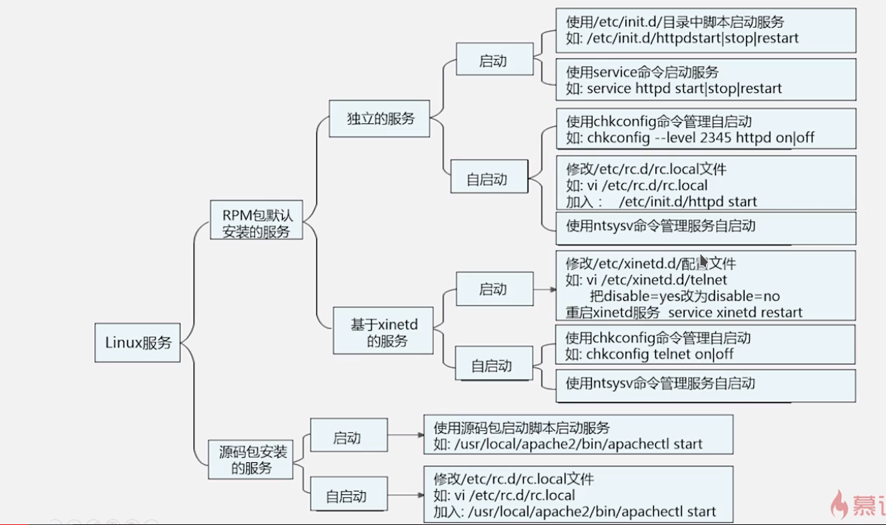

## 常用命令

### 挂载
* mount \[-t 文件系统\] \[-o 特殊选项\] 设备文件名 挂载点
> 光盘的默认设备名称为```sr0```
* umount 设备文件名或挂载点

* fdisk -l (查看系统当前已经识别的硬盘)  
`mount -t vfat /dev/sdb1 /mnt/usb/` (挂载U盘，其中sdb1为U盘设备名)

### 压缩 打包
* zip
    - zip 压缩文件名 源文件
    - zip -r 压缩文件名 源目录
    - unzip 压缩文件 (解压缩)

* gz
    - gzip 源文件 (源文件消失)
    - gzip -c 源文件 > 压缩文件 (源文件保留)
    - gzip -r 目录 (压缩目录下的所有子文件，但是不能压缩目录)
    - gzip -d 压缩文件 (解压缩文件)
    - gunzip 压缩文件 (解压缩文件 -r)

* bz2
    - bzip2 源文件 (压缩为.bz2格式，不保留源文件)
    - bzip2 -k 源文件 (压缩之后保留源文件)
    - **bzip2 不能压缩目录**
    - bzip2 -d 压缩文件 (解压缩，-k保留压缩文件)
    - bunzip2 压缩文件 (解压缩，-k保留压缩文件)

* tar
    - tar -cvf 打包文件名 源文件 (c打包，v显示过程，f指定打包后的文件名)
    - tar -xvf 打包文件名 (x解打包)
    - tar -zcvf 压缩包名.tar.gz 源文件 (z压缩为.tar.gz格式，多个源文件用空格隔开)
    - tar -zxvf 压缩包名.tar.gz (解压缩.tar.gz格式)
    - tar -jcvf 压缩包名.tar.bz2 源文件 (j压缩为.tar.bz2格式)
    - tar -jxvf 压缩包名.tar.bz2 (解压缩.tar.bz2格式)
    - tar -z(j)xvf 压缩报名.tar.gz(.bz2) -C 指定目录
    - tar -ztvf 压缩包名 (t查看压缩包中的内容)

### grep
`grep 选项 字符串 文件名` 在文件当中匹配符合条件的字符串
* `-i`: 忽略大小写
* `-v`: 排除指定字符串

*grep使用正则，find使用通配符*

### 多命令顺序执行

| 多命令执行符 | 格式         | 作用                         |
|--------------|--------------|------------------------------|
| ;            | 命令1;命令2  | 多个命令顺序执行             |
| &&           | 命令1&&命令2 | 1正确2才会执行，1错误2不执行 |
| \|\|         |命令1\|\|命令2| 1正确2不执行，1错误2执行     |

### 输出重定向

标准输入输出  

|设备  |设备文件名 |文件描述符|类型        |
|:----:|:---------:|:--------:|:----------:|
|键盘  |/dev/stdin |     0    |标准输入    |
|显示器|/dev/stdout|     1    |标准输出    |
|显示器|dev/stderr |     2    |标准错误输出|


| 类型     | 符号                    | 作用                           |
|:--------:|:-----------------------:|:------------------------------:|
| 1        | 命令 > 文件             | 覆盖                           |
| 1        | 命令 >> 文件            | 追加                           |
| 2        | 错误命令 2> 文件        | 覆盖                           |
| 2        | 错误命令 2>> 文件       | 追加                           |
| 同时保存 | 命令 > 文件 2>&1        | 正确错误保存到同一个文件，覆盖 |
| 同时保存 | 命令 >> 文件 2>&1       | 同上，追加方式                 |
| 同时保存 | 命令 &> 文件            | 正确错误保存到同一个文件，覆盖 |
| 同时保存 | 命令 &>> 文件           | 同上，追加方式                 |
| 同时保存 | 命令 >> 文件1 2>> 文件2 | 正确输出到1，错误输出到2       |

输入重定向
* `wc`
* 命令 < 文件 # 把文件作为命令的输入
* 命令 << 标志符 # 当输入再次遇到标志符时结束输入

### 特殊符号

* 管道符  
| (命令1|命令2)  
命令1的结果作为命令2的操作对象

* 通配符

| 通配符 | 作用                                                                                      |
|--------|-------------------------------------------------------------------------------------------|
| ?      | 匹配任意一个字符                                                                          |
| *      | 匹配任意内容                                                                              |
| []     | 匹配中括号中任意一个字符，例如[abc]，或者是a，或者是b，或者是c                            |
| [-]    | 匹配中括号中任意一个字符，-表示范围，例如[a-z]，代表匹配一个小写字母                      |
| [^]    | 逻辑非，匹配不是中括号中任意一个字符，-表示范围，例如\[^0-9\]，代表匹配一个不是数字的字符 |

* bash中其他特殊符号  

| 符号 | 作用                                                                                        |
|------|---------------------------------------------------------------------------------------------|
| ''   | 单引号，在引号中的特殊符号都没有特殊含义                                                    |
| ""   | 双引号，在引号中的特殊符号没有特殊含义，但是“$”(调用变量值)、“`”(引用命令)、“\”(转义符)例外 |
| ``   | 反引号，反引号括起来的是系统命令，在bash中会先执行它。和$()作用一样，推荐使用$()            |
| $()  | 同上                                                                                        |
| #    | 注释                                                                                        |
| $    | 调用变量的值                                                                                |
| \\   | 转义符                                                                                      |

### 网络
* ifconifg 查看与配置网络状态
* ifdown 网卡设备  
禁用该网卡设备
* ifup 网卡设备  
启用该网卡设备
* netstat 查询网络连接状态
    - -t: 列出TCP协议端口
    - -u: 列出UDP协议端口
    - -n: 不使用域名和服务名，而使用IP地址和端口号
    - -l: 仅列出在监听状态网络服务
    - -a: 列出所有的网络连接
    - -r: 列出路由表，功能和route命令一致

* route -n 查看路由列表(可以看到网关)
* route add default gw 192.168.1.1  
临时设定网关
* route del default gw 192.168.1.1  
删除网关

* nslookup 域名解析命令
    - nslookup [主机名或IP] (进行域名与IP地址解析)
    - $ nslookup  
     \> server 查看本机DNS服务器

* ping -c 次数(指定ping保的数量)
* telnet 域名或IP 端口 (远程管理与端口探测)
* traceroute 选项 IP或域名(路由跟踪，-n使用IP不使用域名)
* wget + 地址 (下载)
* tcpdump -i eth0 -nnX port 21 (抓包)
    - -i 指定网卡接口
    - -nn 将数据包中的域名与服务转为IP和端口
    - -X 以十六进制和ASCII码显示数据包内容
    - port 指定监听端口

* ssh 用户名@ip (远程管理指定服务器)
* scp [-r] 用户名@ip:文件路径 本地路径 (下载)
* scp [-r] 本地路径 用户名@ip:上传路径 (上传)


## 软件安装

### RPM

* 包全名：操作的包是没有安装的软件包时，使用包全名。而且要注意路径
* 包名：操作已经安装的软件包时，使用包名，是搜索`/var/lib/rpm`中的数据库

* rpm -ivh 包全名
    - -i (install) 安装
    - -v (verbose) 显示详细信息
    - -h (hash) 显示进度
    - --nodeps 不检测依赖性
* rpm -Uvh 包全名
    - -U (upgrade) 升级
    - --nodeps 
* rpm -e 包名
    - -e (erase) 卸载
    - --nodeps 
* rpm -q 包名
    - -q (query) 查询包是否安装
    - -qa (all) 查询所有安装的rpm包(不加包名)
* rpm -qi 包名
    - -i (information) 查询软件信息
    - -q (package) 查询未安装包信息(跟包全名)
* rpm -ql 包名 (查询包中文件安装位置)
    - -l (list) 列表
    - -p 查询未安装包信息
* rpm -qf 系统文件名
    - -f (file) 查询系统文件属于哪个软件包
* rpm -qR 包名 
    - -R (requires) 查询软件包的依赖性
    - -p 查询未安装的包的信息
* rpm -V 已安装包名
    - -V (verify) 校验指定RPM包中的文件
    - 校验内容中的8个信息的具体内容如下：
        * S 文件大小是否改变
        * M 文件类型或文件权限(rwx)是否改变
        * 5 文件MD5校验和是否改变(可以看成文件内容是否改变)
        * D 设备的主从代码是否改变
        * L 文件路径是否改变
        * U 文件属从(所有者)是否改变
        * G 文件属组是否改变
        * T 文件的修改时间是否改变
    - 文件类型
        * c (config) 配置文件
        * d (documentation) 普通文件
        * g (ghost file) “鬼”文件，很少见，就是该文件不应该被这个RPM包包含
        * L (license file) 授权文件
        * r (read me) 描述文件
* rpm2cpio 包全名 | cpio -idv .文件绝对路径 
    - -rpm2cpio 将rpm包转化为cpio格式的命令
    - -cpio 是一个标准工具，它用于创建软件档案文件和从档案文件中提取文件  
    `cpio 选项 < [文件|设备]`  
        * -i: copy-in 模式，还原
        * -d: 还原时自动新建目录
        * -v: 显示还原过程

### YUM

Yum 源文件`/etc/yum.repos.d/CentOS-Base.repo`
* [base] 容器名称，一定要放在[]中
* name 容器说明，可以随便写
* mirrorlist 镜像站点
* baseurl yum源服务器地址，默认是CentOS官方的yum源服务器
* enable 生效为1或者不写，为0不生效
* gpgcheck RPM的数字证书，1生效，0不生效
* gpgkey 数字证书的公钥保存位置。不用修改

常用yum命令
* yum list # 查询所有可用软件包列表
* yum search # 搜索服务器上所有和关键字相关的包
* yum -y install 包名 # 安装
    - -y自动回答yes
    - install 安装
* yum -y update 包名 # 升级
* yum remove 包名 # 卸载

*服务器使用最小化安装，用什么装什么，尽量不卸载*

yum软件组管理命令
* yum grouplist # 列出所有软件组列表
* yum groupinstall 软件组名 # 安装指定软件组，组名可以用grouplist查询出来
* yum groupremove 软件组名 # 卸载指定软件组名

### 源码包

1. 安装在指定位置，一般是`/usr/local/软件名`
2. 安装注意事项  
   * 源代码保存位置：`/usr/local/src/`
   * 软件安装位置：`/usr/local/`
   * 软件配置与检查 `./configure`  
        - 定义需要的功能项
        - 检测系统环境是否符合安装要求
        - 把定义好的功能选项和检测系统环境的信息都写入Makefile文件，用于后续的编辑
        ```bash
        ./configure --prefix=/usr/local/软件名 # 产生Makefile文件
        make # 编译
        # make clean 如果编译报错，使用这个命令清除编译缓存文件
        make install # 安装
        # 安装出错首先make clean，再删除这个软件目录
        ```

## 权限管理

* chmod # 改变权限
* chown 用户名 文件名 # 改变所有者
* chgrp 组名 文件名 # 改变所属组

### 文件默认权限
* 文件不能默认建立为执行文件，必须手工赋予执行权限
* 文件默认权限最大为666
* **默认权限需要换算成字母再相减**
* 建立文件之后的默认权限，为666减去umask的值

目录默认权限
* 目录默认最大权限为777

修改umask值
```bash
umask 0022 # 临时生效
vim /etc/profile # 永久
```

### ACL权限

为了解决用户身份不够用的问题

查看分区的ACL权限是否开启  
```bash
dumpe2fs -h /dev/sda5
# 查询指定分区详细文件系统信息
# -h 仅显示超级快中信息，而不显示磁盘块组的详细信息
```

临时开启分区ACL权限
```bash
mount -o remount,acl /
# 重新挂载根分区，并挂载加入ACL权限
```

永久开启分区ACL 权限
```bash
vim /etc/fstab
# default后加acl
mount -o remount /
# 重新挂载文件系统或者重启系统，使修改生效
```

查看ACL命令
```bash
getfacl 文件名
# 查看ACL权限
```

设定ACL权限  
setfacl 选项 [用户名或组名] 文件名(目录)
* -m 设定ACL权限
* -x 删除指定的ACL权限
* -b 删除所有的ACL权限
* -d 设定默认ACL权限  
  给目录设定默认权限，那么目录的所有新建子文件都会继承父目录的acl权限。
* -k 删除默认ACL权限
* -R 递归设定ACL 权限 (放在目录前，只能针对目录使用)

```bash
setfacl -m u:user1:rx abc # 为user1用户设置abc文件(或目录)的权限读和执行
setfacl -m g:group1:rx abc # 为用户组设置权限
```

最大有效权限mask  
mask用来指定最大有效权限，如果给用户赋予了acl权限，是需要与mask“相与”才能得到用户的真正权限

修改最大有效权限
```bash
setfacl -m m:rx 文件
```

### SUDO

root把本来只能超级用户执行的命令赋予普通用户执行  
sudo的操作对象是系统命令

```bash
visudo
# 实际修改的是/etc/sudoers文件
```
添加内容`user1 ALL=(ALL) /sbin/shutdown -h now`表示允许user1用户在任何主机上切换为任何用户，允许使用`/sbin`目录下`shutdown -h now`这条命令，(ALL)可以省略，'='后直接接上命令的绝对路径，默认认为是root身份。

```bash
user1 ALL=/usr/bin/passwd [A-Za-z]*, !/usr/bin/passwd "", !/usr/bin/passwd root
# 允许uer1修改用户密码，但不允许修改root的密码
```

### 文件特殊权限

* SetUID
    - 只有可执行的二进制文件才能设定SUID权限
    - 命令执行者要对该程序拥有x权限
    - 命令执行者在执行该程序时获得该程序文件属主的身份
    - SetUID权限只在该程序执行过程中有效，也就是说身份的改变只在程序执行过程中有效
    - `chmod 4755(u+s) abc # 赋予SUID权限`
    - 检查脚本  
    ```bash
    #!/bin/bash

    find / -perm -4000 -o -perm -2000 > /tmp/setuid.check
    # 搜索系统中所有拥有SUID和SGID的文件，并保存到临时目录中。
    for i in $(cat /tmp/setuid.check)
    # 做循环，每次循环取出临时文件中的文件名
    do
        grep $i /root/suid.log > /dev/null
        # 对比这个文件名是否在模板文件中
            if [ "$?" != "0" ]
            # 检测上一个命令的返回值，如果不为0，证明上一个命令报错
            then
                echo "$i isn't in listfile!" >> /roo/suid_log_$(date +%F)
                # 如果文件名不在模板文件中，则输出错误信息，并把报错写入日志中
            fi
    done
    rm -rf /tmp/setuid.check
    ```

* SetGID (可以对目录生效)
    - `chmod 2755(g+s) abc # 赋予SGID权限`
    - **针对文件**
        * 只有可执行的二进制文件才能设定SUID权限
        * 命令执行者要对该程序拥有x权限
        * 命令执行者在执行该程序时组身份升级为该程序文件属组的身份
        * SetGID权限只在该程序执行过程中有效，也就是说组身份的改变只在程序执行过程中有效
    - **针对目录**
        * 普通用户必须对此目录拥有r和x权限，才能进入此目录
        * 普通用户在此目录中的有效组会变成此目录的属组
        * 若普通用户对此目录拥有w权限时，新建的文件的默认属组是这个目录的属组

* Sticky BIT (粘着位权限)
    - 粘着位目前只对目录有效
    - 普通用户对该目录拥有w和x权限
    - 如果没有粘着位，因为普通用户有w权限，所以可以删除此目录下所有文件，一旦赋予了粘着位，除了root可以删除所有用户建立的文件，普通用户就算有w权限也只能删除自己建立的文件
    - `chmod 1755(o+t) 目录`

* 不可改变位权限(chattr权限)
    - `chattr [+-=] 选项 文件或目录名`
    - +：增加权限
    - -：删除权限
    - =：等于某权限
    - 选项
        * i (insert)  
        不允许对文件进行删除、改名，也不能添加和修改数据；如果目录设置i属性，那么只能修改目录下文件的数据，但不允许建立和删除文件
        * a (append)  
        只能在文件中添加或增加数据，但是不能删除也不能修改数据；如果对目录设置a属性，那么只允许在目录中建立和修改文件，但是不允许删除
    - `lsattr [-d] 文件名(目录) # 查看attr权限，目录加-d，显示所有-a`

## 计划任务Crontab

* 被周期性执行的任务称为Cron Job
* 周期性执行的任务列表称为Cron Table

### Crontab 的配置文件

```bash
* * * * * command
```
分钟0~59  
小时0~23  
日期1~31  
月份1~12  
星期0~7(0,7均表示星期天)

```bash
# 每晚的21:30重启apache
30 21 * * * service httpd restart

# 每月的1、10、22日的4:45重启apache
45 4 1,10,22 * * service httpd restart

# 每月的1到10日的4:45重启apache
45 4 1-10 * * service httpd restart

# 每隔两分钟重启Apache服务器
*/2 * * * * service httpd restart
1-59/2 * * * * service httpd restart

# 晚上11点到早上7点之间，每隔一小时重启apache
0 23-7/1 * * * service httpd restart

# 每天18:00至23:00之间每隔30分钟重启apache
0,30 18-23 * * * service httpd restart
0-59/30 18-23 * * * service httpd restart
```

* *表示任何时候都匹配
* 用"A,B,C"表示A或者B或者C时执行命令
* 用"A-B"表示A到B之间执行命令
* 用"*/A"表示每A分钟(小时等)执行一次命令

## 服务管理

***Warning: 这里的服务管理是在centos6中的使用，下面记录的方式已经开始被新的服务管理代替，对服务管理有一个大概的了解先。新的服务管理如systemctl命令和新的配置文件路径，自行查阅文档或者Google***

| 运行级别 | 含义                                                      |
|----------|-----------------------------------------------------------|
| 1        | 单用户模式，可以想象为windows的安全模式，主要用于系统修复 |
| 2        | 不完全的命令行模式，不含NFS服务                           |
| 3        | 完全的命令行模式，就是标准字符界面                        |
| 4        | 系统保留                                                  |
| 5        | 图形界面                                                  |
| 6        | 重启动                                                    |

`/etc/inittab # 系统默认运行级别配置文件，现在把功能分散在不同的配置文件中`

### 服务的分类

* Linux服务
    - rpm包默认安装服务
        * 独立的服务
        * 基于xinetd服务 (逐渐淘汰)
    - 源码包安装的服务

```bash
chkconfig --list 
# 查看服务运行状态、自启动状态，可以看到所有RPM包安装的服务
```

### rpm包服务管理

rpm 安装服务和源码包安装服务的区别就是安装位置的不同  
* 源码包安装在指定位置，一般是`/usr/local/`
* rpm包安装在默认位置中
    - `/etc/init.d/`:启动脚本位置
    - `/etc/sysconfig`:初始化环境配置文件位置
    - `/etc/`:配置文件位置
    - `/etc/xinetd.conf`:xinetd配置文件
    - `/etc/xinetd.d/`:基于xinetd服务的启动脚本
    - `/var/lib/`:服务产生的数据放在这里
    - `/var/log`:日志

* 独立服务的管理
    - 独立服务的启动
        * `/etc/init.d/独立服务名 start|status|restart|`
        * `service 独立服务名 start|status|restart|`
    - 独立服务的自启动
        * `chkconfig --level 运行级别 独立服务名 on|off`
        * 修改`/etc/rc.d/rc.local`文件
        * 使用`ntsysv命令管理自启动`


* 基于xinetd服务的管理
    - 安装xinetd
    - xinetd服务的启动  `vim /etc/xinetd.d/rsync`
      ```
      service rsync                 # 服务名称
      {
        flags = REUSE               # 标志为REUSE，设定TCP/IP socket可重用
        socket_type = stream        # 使用TCP协议数据包
        wait = no                   # 允许多个连接同时连接
        user = root                 # 启动服务的用户为root
        server = /usr/bin/rsync     # 服务的启动程序
        log_on_failure += USERID    # 服务不启动
        disable = no                # 服务不启动
      }
      ```
    - xinetd服务的自启动(和启动一样)

### 源码包服务

* 启动  
  **使用绝对路径**，调用启动脚本来启动。不同的源码包的启动脚本不同。可以查看源码包的安装说明，查看启动脚本的方法。  
  `/usr/local/apache2/bin/apachectl start|stop`
* 自启动  
  `/etc/rc.d/rc.local`中加入`/usr/local/apache2/bin/apachectl start`

* 通过修改配置文件的方式可以使得源码包安装的服务能够被rpm包服务的管理方式识别

这里放一张大致的图  


## 系统管理

### 进程管理

1. 进程管理作用  
    * 判断服务器的健康状态
    * 查看系统中所有的进程
    * 杀死进程
2. 进程的查看ps命令和pstree命令
    * `ps aux` # 查看系统中所有进程，使用BSD操作系统格式
    * `ps -le` # 查看系统中所有进程，使用Linux标准命令格式
    * 选项  
        - a:显示一个终端的所有进程，除了会话引线
        - u:显示进程的归属用户及内存的使用情况
        - x:显示没有控制终端的进程
        - -l:长格式显示，显示更加详细的信息
        - -e:显示所有进程，和-A作用一致
    * 输出  
        - USER
        - PID
        - %CPU
        - %MEM
        - VSZ: 该进程占用虚拟内存的大小，单位KB
        - RSS: 该进程占用实际物理内存的大小，单位KB
        - TTY: 该进程是在哪个终端运行的，其中tty1-tty7代表本地控制台终端，tty1-tty6是本地的字符界面终端，tty7是图形终端。pts/0-xxxx代表虚拟终端。
        - STAT: 进程状态，常见状态有:
            * R:运行
            * S:睡眠
            * T:停止状态
            * s:包含子进程
            * +:位于后台
        - START: 该进程的启动时间
        - TIME: 该进程占用CPU运算的时间，注意不是系统时间
        - COMMAND: 产生此进程的命令名
    * `pstree` # 查看进程树  
        - p: 显示进程的PID
        - u: 显示进程的所属用户
3. 进程的查看top命令  
    * 选项:  
        - -d秒数: 指定top命令每隔几秒更新。默认是3秒
        - -b: 使用批处理模式输出。一般和“-n”选项合用
        - -n次数: 指定top命令执行的次数。一般和“-b”选项合用
    * 交互模式中可以执行的命令:  
        - ?或h: 显示交互模式的帮助
        - P: 以CPU使用率排序，默认就是此项
        - M: 以内存的使用率排序
        - N: 以PID排序
        - q: 退出top
    * 第一行为任务队列信息  

| 内容                         | 说明                                                                                               |
|------------------------------|----------------------------------------------------------------------------------------------------|
| 12:26:45                     | 系统当前时间                                                                                       |
| up 1 day, 13:32              | 系统的运行时间，本机已经运行1天13小时32分钟                                                        |
| 2 users                      | 当前登录了两个用户                                                                                 |
| load average: 0.42 0.99 0.94 | 系统在之前1分钟，5分钟，15分钟的平均负载。一般认为小于1时，负载较小。如果大于1，系统已经超出负荷。 |

      (**最后一个的指标已经过时，一般可以看cpu的核数，如4核就应该不超过4，双核就不超过2**)
      
    * 第二行为进程信息  
    
| 内容             | 说明                                      |
|------------------|-------------------------------------------|
| Tasks: 95 totall | 系统中的总进程数                          |
| 1 running        | 正在运行的进程数                          |
| 94 sleeping      | 睡眠的进程                                |
| 0 stopped        | 正在停止的进程                            |
| 0 zombie         | 僵尸进程，如果不是0，需要手工检查僵尸进程 |

    * 第三行为CPU信息  

| 内容 | 说明                                                                         |
|------|------------------------------------------------------------------------------|
| us   | 用户模式占用的CPU百分比                                                      |
| sy   | 系统模式占用的CPU百分比                                                      |
| ni   | 改变过优先级的用户进程占用的CPU百分比                                        |
| id   | 空闲CPU的CPU百分比                                                           |
| wa   | 等待输入/输出的进程的占用CPU百分比                                           |
| hi   | 硬中断请求服务占用的CPU百分比                                                |
| si   | 软中断请求服务占用的CPU百分比                                                |
| st   | (Steal time)虚拟时间百分比，就是当有虚拟机时，虚拟CPU等待实际CPU的时间百分比 |

    * 第四行为物理内存信息
    * 第五行为交换分区(swap)信息
      
4. 杀死进程
    * `kill`  
        - -l # 查看可用的进程信号
        - -信号代号或信号名称 进程pid，例如:  
            + `kill -1 1234` # 平滑重启1234进程(平滑：重新加载配置文件，但不会踢出已经登录的用户)
            + `kill -9 1234` # 强制杀死1234进程
    * `killall [选项] [信号] 进程名` # 按照进程名杀死进程
        - -i: 交互式，询问是否要杀死某个进程
        - -I: 忽略进程名的大小写
    * `pkill [选项] [信号] 进程名` # 按照进程名终止进程  
        - -t 终端号: 按照终端号踢出用户  
            `pkill -9 -t pts/1` # 强制杀死从pts/1虚拟终端登录的进程

5. 修改进程优先级  
   PRI代表Priority，NI代表Nice。这两个都是优先级，数字越小优先级越高  
   修改NI时的注意事项：  
   * 范围 [-20,19]，普通用户不能设置负值
   * 普通用户只能调高NI的值，不能降低
   * PRI(最终值) = PRI(原始值) + NI
   * 用户只能修改NI的值，不能直接修改PRI

   `nice` 命令
   * nice 选项 命令 # nice命令可以给新执行的命令直接赋予NI值，但是不能修改已经存在进程的NI值。
   * 选项  
        - -n NI值: 给命令赋予NI值

   `renice` 命令
   * renice [优先级] PID # 修改已经存在的进程的优先级
   

### 工作管理

注意事项  
* 当前登录终端，只能管理当前终端的工作，而不能管理其他登录终端的工作
* 放入后台的命令必须可以持续运行一段时间，这样我们才能捕捉和操作这个工作
* 放入后台的命令不能和前台用户有交互或需要前台输入，否则放入后台只能暂停，而不能执行

把进程放入后台  
* 命令后加`&` # 把命令放入后台，并在后台执行
* Ctrl-z # 放在后台暂停

查看后台的工作`jobs`  
* 选项:  
    - -l: 显示工作的PID
    - `+`代表最近一个放入后台的工作，也是工作恢复时，默认恢复的工作。`-`代表倒数第二个放入后台的工作

将后台暂停的工作恢复到前台执行`fg %工作号`
* 参数:  
    - %工作号: `%`号可以省略，但是注意工作号和PID的区别

将后台暂停的工作恢复到后台执行`bg %工作号`
同样，后台恢复执行的命令，是不能和前台有交互的，否则不能恢复到后台执行

后台命令脱离终端执行  
1. 把需要执行的命令加入`/etc/rc.local`文件
2. 使用系统定时任务，让系统在指定的时间执行某个命令
3. 使用nohup命令

### 系统资源查看

1. `vmstat` 命令监控系统资源  
    `vmstat 刷新延时 刷新次数` 例如 `vmstat 1 3`
    * `procs` 进程信息字段  
        - `r`: 等待运行的进程数，数量越大，系统越繁忙。
        - `b`: 不可被唤醒的进程数量，数量越大，系统越繁忙。
    * `memory` 内存信息字段  
        - `swpd`: 虚拟内存的使用情况，单位KB
        - `free`: 空闲的内存容量，单位KB
        - `buff`: 缓冲的内存容量，单位KB
        - `cache`: 缓存的内存容量，单位KB
    * `system` 系统信息字段  
        - `in`: 每秒被中断的进程次数。越大越繁忙。
        - `cs`: 每秒钟进行的事件切换次数。越大越繁忙。
    * `CPU` CPU信息字段  
        - `us`: 非内核进程消耗CPU运算时间的百分比。
        - `sy`: 内核进程消耗CPU运算时间的百分比。
        - `id`: 空闲CPU的百分比。
        - `wa`: 等待I/O所消耗的CPU百分比。
        - `st`: 被虚拟机所盗用的CPU占比。

2. `dmesg` # 开机时内核检测信息

3. `free` # 查看内存使用状态  
    - `-b`:以B为单位 
    - `-k`:以KB为单位，默认
    - `-m`:以MB为单位
    - `-g`:以GB为单位

4. `/proc/cpuinfo` # CPU信息

5. `uptime` # 显示系统的启动时间和平均负载，相当于`top`的第一行，`w`也可以

6. `uname` # 查看系统与内核相关信息  
    - `-a`: 查看系统所有相关信息
    - `-r`: 查看内核版本
    - `-s`: 查看内核名称

7. `file /bin/ls` # 判断当前系统的位数(通过命令的位数来判断系统的位数)  
   `getconf LONG_BIT` 通过查看 long 数据类型的长度来判断系统的位数

8. `lsb_release -a` # 查看当前Linux系统的发行版本

9. `lsof` # 列出进程调用或打开的文件的信息  
    - `lsof`: 查询系统中所有进程调用的文件 
    - `path/to/file`: 查询某个文件被哪个进程调用(必须是系统文件)
    - `-c httpd`: 查看httpd进程调用来哪些文件
    - `-u root`: 查询root用户的进程调用的文件名
    - `-i :port`: 查询占用某端口的进程
        * `-i 6`: 仅获取 IPv6 流量
        * `-iTCP`: 仅显示 TCP 连接信息
        * `-i@ip:port`: 指定 IP 和 端口
    - `-p PID`: 查询某PID的进程
    - `-t path/to/file`: 仅输出进程ID(PID)

### 系统定时任务

1. at一次性定时任务  
    * at访问控制
    * `-m 时间`: 当at工作完成后，无论是否有输出，都用email通知执行at命令的用户
    * `-c 工作号`: 显示该at工作的实际内容
    * `atq` # 查询
    * `atrm 工作号` # 删除指定的at任务

2. crontab循环定时任务  
    * `-e`: 编辑crontab定时任务
    * `-l`: 查询crontab任务
    * `-r`: 删除当前用户所有的crontab任务

3. 系统的crontab设置

编辑`/etc/crontab`(被anacron的管理方式取代)

把需要定时执行的脚本复制到`/etc/cron.{daily, weekly, monthly}`中

4. anacron配置

anacron是用来保证在系统关机的时候错过的定时任务，可以在系统开机之后再执行

* anacron会使用一天，七天，一个月作为检测周期
* 在系统的`/var/spool/anacron/`目录中存在`cron.{daily, weekly, monthly}`文件，用于记录上次执行cron的时间
* 和当前时间做比较，如果两个时间的差值超过来anacron的指定时间差，证明有cron任务没有执行

配置文件`/etc/anacrontab`
* RANDOM_DELAY=45 # 最大随机延迟
* START_HOURS_RANGE=3-22 # anacron的执行时间范围是3:00-22:00
```
1       5            cron.daily              nice run-parts /etc/cron.daily
7       25           cron.weekly             nice run-parts /etc/cron.weekly  
#天数  强制延迟(分)  工作名称                   实际执行的命令
```
