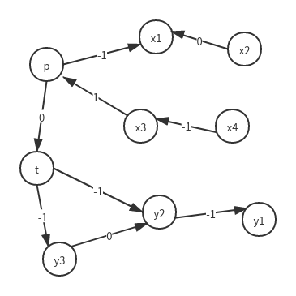
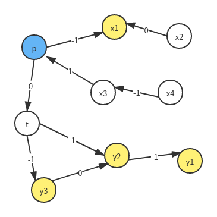
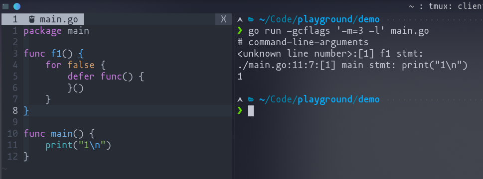
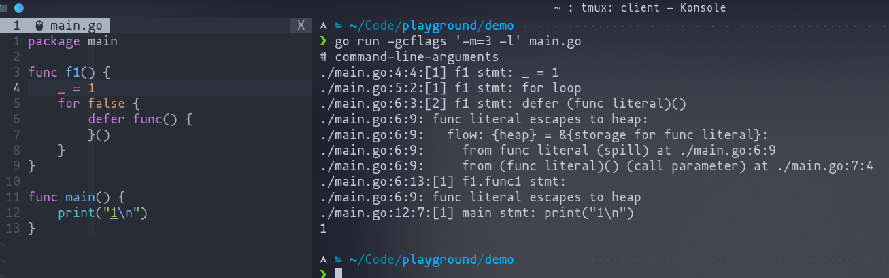

## Go Escape 逃逸分析

参考
* [Bilibili 渣理大大 深入研究Go中的逃逸分析](https://www.bilibili.com/video/BV1Qi4y1K7ep)
* [escape.go 中的注释](https://github.com/golang/go/blob/master/src/cmd/compile/internal/escape/escape.go)

声明变量需要在堆或栈中分配内存

* 堆(heap)
    - 全局的存储空间
    - 这里的对象可以共享
    - 由 GC 管理
* 栈(stack)
    - 存储空间属于一个函数
    - 每一个栈的和一个 goroutine 绑定
    - 私有
    - 对象的生命周期由所属栈管理


除了上述的对比外，在栈上分配的速度比在堆上要快得多，由于每个 goroutine 可以
完全控制自己的栈空间，不需要加锁，没有 GC。

看两种分配方式的对比
```go
type T struct {
	X int32 // 大小: 4B
	//X [1024]int32 // 大小: 4KB
	//X [10 * 1024 * 1024]byte  // 大小: 10MB
	//X [10 * 1024 * 1024]int32 // 大小: 40MB
}

var global interface{}

func BenchmarkAllocOnHeap(b *testing.B) {
	b.ReportAllocs()
	for i := 0; i < b.N; i++ {
		global = &T{}
	}
}

func BenchmarkAllocOnStack(b *testing.B) {
	b.ReportAllocs()
	for i := 0; i < b.N; i++ {
		local := T{}
		_ = local
	}
}
```

```bash
❯ go test -bench=Alloc alloc_test.go
goos: linux
goarch: amd64
cpu: AMD Ryzen 7 4800H with Radeon Graphics
BenchmarkAllocOnHeap-16         66429784                18.79 ns/op            4 B/op          1 allocs/op
BenchmarkAllocOnStack-16        1000000000               0.2372 ns/op          0 B/op          0 allocs/op
PASS
ok      command-line-arguments  2.549s
```

在把`T`中的`X`换第二个数据类型试试看
```bash
❯ go test -bench=Alloc alloc_test.go
goos: linux
goarch: amd64
cpu: AMD Ryzen 7 4800H with Radeon Graphics
BenchmarkAllocOnHeap-16          1000000              1117 ns/op            4096 B/op          1 allocs/op
BenchmarkAllocOnStack-16        1000000000               0.2842 ns/op          0 B/op          0 allocs/op
PASS
ok      command-line-arguments  1.477s
```

再换成第三个类型试试
```bash
❯ go test -bench=Alloc alloc_test.go
goos: linux
goarch: amd64
cpu: AMD Ryzen 7 4800H with Radeon Graphics
BenchmarkAllocOnHeap-16              967           1221004 ns/op        10485772 B/op          1 allocs/op
BenchmarkAllocOnStack-16        1000000000               0.2869 ns/op          0 B/op          0 allocs/op
PASS
ok      command-line-arguments  1.635s
```

可以看到栈中分配的速度快得多，理由是当栈空间生成的时候，
分配的内存空间就基本上完成了，因此跑起来差不多，但是对于堆来说是额外申请的内存。

不过，如果申请的空间过大的话，比如第四种数据类型，再来看看测试结果。
```bash
 ❯ go test -bench=Alloc alloc_test.go
goos: linux
goarch: amd64
cpu: AMD Ryzen 7 4800H with Radeon Graphics
BenchmarkAllocOnHeap-16              279           4349829 ns/op        41943048 B/op          1 allocs/op
BenchmarkAllocOnStack-16             268           4459306 ns/op        41943065 B/op          1 allocs/op
PASS
ok      command-line-arguments  3.295s
```

先来查看前三种的编译优化输出和第四种的区别
```bash
go tool compile -m alloc_test.go
```
```
# 前三种
alloc_test.go:14:6: can inline BenchmarkAllocOnHeap
alloc_test.go:15:16: inlining call to testing.(*B).ReportAllocs
alloc_test.go:21:6: can inline BenchmarkAllocOnStack
alloc_test.go:22:16: inlining call to testing.(*B).ReportAllocs
alloc_test.go:14:27: b does not escape
alloc_test.go:17:12: &T{} escapes to heap
alloc_test.go:21:28: b does not escape
# 第四种
alloc_test.go:14:6: can inline BenchmarkAllocOnHeap
alloc_test.go:15:16: inlining call to testing.(*B).ReportAllocs
alloc_test.go:21:6: can inline BenchmarkAllocOnStack
alloc_test.go:22:16: inlining call to testing.(*B).ReportAllocs
alloc_test.go:14:27: b does not escape
alloc_test.go:17:12: &T{} escapes to heap
alloc_test.go:21:28: b does not escape
alloc_test.go:24:3: moved to heap: local <----------- 分配到了堆
```

### 逃逸分析(escape analysis)

一种机制，用来在**编译期间**，决定一个变量是应该分配在 heap 还是 stack。
一个对象会不会 escape 取决于它如何被使用。

源码的注释中写到逃逸分析有个两个大前提
> FROM: src/cmd/compile/internal/escape/escape.go file: The two
> key invariants we have to ensure are: (1) pointers to stack objects
> cannot be stored in the heap, and (2) pointers to a stack object
> cannot outlive that object (e.g., because the declaring function
> returned and destroyed the object's stack frame, or its space is
> reused across loop iterations for logically distinct variables).

逃逸分析具体发生在什么时候？

可以查看代码仓库中`go/src/cmd/compile/README.md`，本地可以看，
或者[Github](https://github.com/golang/go/blob/master/src/cmd/compile/README.md)


简单来说，逃逸的前提有
* 变量(比如`a`)要被取地址(`&a`)
* 至少有一个用到`&a`已经 escape

什么对象会逃逸？

首先来定义一些关系，假设`p`是全局变量，分配在堆上，`q`定义在函数中
（注意`&`只能作用于可取地址的变量，因此不会出现权小于 -1）
```
                                 +----+  0   +----+
                p = q            | p  |----->| q  |
                                 +----+      +----+
                                                   
                                 +----+  -1  +----+
                p = &q           | p  |----->| q  |
                                 +----+      +----+
                                                   
                                 +----+  1   +----+
                p = *q           | p  |----->| q  |
                                 +----+      +----+
                                                   
                                 +----+  2   +----+
                p = **q          | p  |----->| q  |
                                 +----+      +----+
                                                   
                                 +----+  2   +----+
                p = **&**&q      | p  |----->| q  |
                                 +----+      +----+
                                                   
                                 +----+  -1  +----+
                                 | p  |----->| q  |
                                 +----+      +----+
                p = &q             ^               
                r = p              |               
                                   |   0     +----+
                                   |---------| r  |
                                             +----+

 var x struct{ f, g *int }        +----+  1   +----+
 var y struct{ a, b **int }       | x  |----->| y  |
 x.f = *y.b                       +----+      +----+
```

以一份代码为例
```go
package main

var p **int

func f1() {
	var x1 *int
	p = &x1

	x2 := x1
	x3 := *p
	x4 := &x3
	_ = x2
	_ = x4
}

func f2() {
	var t **int
	y1 := 1
	y2 := &y1
	y3 := y2

	t = &y2
	p = t
	t = &y3
}

func main() {
	f1()
	f2()
}
```

画出对应的数据流图



找到从全局变量 p 出发距离为 -1 的点，并找到以这些点为起点距离为 -1 的点，
以此类推，直到找不到为止。(涉及算法 bellman-ford)



从图中，可以看到，最终 escape 的对象应该有`x1`、`y1`、`y2`、`y3`；再来，编译并
输出优化信息。
```bash
# -m=2 表示更详细的信息，还可以有 -m=3
go run -gcflags='-m=2 -l' main.go
```
```
# command-line-arguments
./main.go:6:6: x1 escapes to heap:
./main.go:6:6:   flow: {heap} = &x1:
./main.go:6:6:     from &x1 (address-of) at ./main.go:7:6
./main.go:6:6:     from p = &x1 (assign) at ./main.go:7:4
./main.go:6:6: moved to heap: x1  <--------------------------- x1 escape
./main.go:20:2: y3 escapes to heap:
./main.go:20:2:   flow: t = &y3:
./main.go:20:2:     from &y3 (address-of) at ./main.go:24:6
./main.go:20:2:     from t = &y3 (assign) at ./main.go:24:4
./main.go:20:2:   flow: {heap} = t:
./main.go:20:2:     from p = t (assign) at ./main.go:23:4
./main.go:19:2: y2 escapes to heap:
./main.go:19:2:   flow: t = &y2:
./main.go:19:2:     from &y2 (address-of) at ./main.go:22:6
./main.go:19:2:     from t = &y2 (assign) at ./main.go:22:4
./main.go:19:2:   flow: {heap} = t:
./main.go:19:2:     from p = t (assign) at ./main.go:23:4
./main.go:18:2: y1 escapes to heap:
./main.go:18:2:   flow: y2 = &y1:
./main.go:18:2:     from &y1 (address-of) at ./main.go:19:8
./main.go:18:2:     from y2 := &y1 (assign) at ./main.go:19:5
./main.go:18:2: moved to heap: y1  <--------------------------- y1 escape
./main.go:19:2: moved to heap: y2  <--------------------------- y2 escape
./main.go:20:2: moved to heap: y3  <--------------------------- y3 escape
```

除了上述情况，还有哪些情况会 escape

> 下面面提到的几种情况在 Github 的 [golang/go](https://github.com/golang/go/tree/master/test)
> 项目中，test 文件夹下面的 `escape*.go` 文件里有样例，可以作为参考

1. 特大的对象: 显示声明(`var`、`:=`)的超过 10MB；隐式(`new`、`make`)超过 64KB；
   例如前面 benchmark 中的第四种情况
2. slice: 如果定义的时候没有指定容量(capacity)则 slice escape
3. 在 slice、map、chan 中: 存放了指针类型的数据(map 无论是 key 还是 value)，无论
   该 slice、map、chan 是否 escape，存放的指针类型数据都会 escape （我尝试了
   一下，类型为函数也会 escape，当然 map 的 key 不能是函数
4. 返回值(return values): 返回的值是指针类型或者是 map、slice，（同上尝试了一下
   返回值是函数也会 escape
5. 入参(input parameters): 如果最后参数本身是指针，最后返回出去了，那就 escape 了，
   或者本身不是指针，但有个变量是参数的指针，然后返回了，也会 escape(这个和上一
   条一样)
6. 闭包(Closure function): 闭包函数内部的变量被外部的变量引用，或者外部变量引用
   内部的，(对应前面的数据流图中的关系 -1)
7. for + defer func 的形式，如下
```go
package main

func f1() {
	for i := 0; i < 0; i++ {
		defer func() { // func literal escapes to heap
		}()
	}
}

func main() {}
```

这种情况似乎还有一个特例(后面有两张图，对比起来看像是被作为特殊情况对待优化掉了，
也可能是我的理解有问题)
```go
package main

func f1() {
	for false {
		defer func() { // 没有输出 func literal escapes to heap
		}()
	}
}

func main() {
	print("1\n") // 加一条输出，这样看到输出结果了就能确保程序正确执行了
}
```



另外一点，在使用`fmt.Printf("%d\n", a)`类似函数时候，会使`a`逃逸

### 结论

结论其实比较简单

* escape 通常发生在对象被取地址的情况和对象的大小不确定的情况下
* 向函数中传递参数比从函数中返回参数来得安全

优化建议(简单来说，谨慎使用指针类型)

* 函数入参返回考虑清楚是否真的需要指针，可以的话尽量不要用指针
* 可以的话尽量初始化 slice 的容量，但是注意给的值要是个常数
  (只指定常数长度也行，因为容量默认和长度一样)
* 使用闭包的时候尽量把变量作为参数传入，而不是直接引用
* 把变化直接作用在函数的入参上，而不是最后作为返回值返回出来，如下面 Go 标准库
  中的做法
```go
func (b *Reader) Read(p []byte) (n int, err error) {
//...
}
```

另外，没有必要过早的对程序进行优化操作，当出现一些性能的问题的时候再优化也不迟
