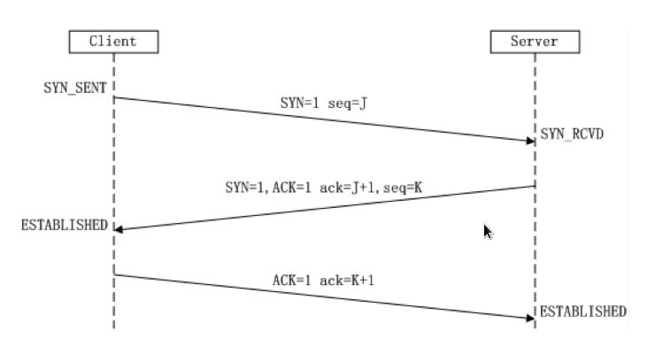
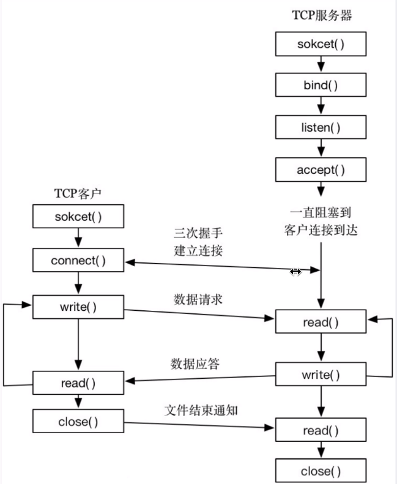

浏览器输入一个url中间经历的过程
* 中间涉及到了哪些过程
* 包含哪些网络协议
* 每个协议都干了什么

DNS 查询 -> TCP 握手 -> HTTP 请求 -> 反向代理 Nginx -> uwsgi/gunicorn -> web app 响应 -> TCP 挥手

TCP 三次握手过程, 状态转换

TCP 四次挥手, 状态转换

TCP/UDP 的区别
* TCP 面向连接, 可靠的, 基于字节流
* UDP 无连接, 不可靠, 面向报文

HTTP 协议
* 请求的组成
    - 状态行
    - 请求头
    - 消息主体
* 响应的组成
    - 状态行
    - 响应头
    - 响应正文
* 常见状态码
    - 1\*\* 信息, 服务器收到请求, 需要请求者继续执行操作
    - 2\*\* 成功, 操作被成功接受并处理
    - 3\*\* 重定向, 需要进一步操作完成
    - 4\*\* 客户端错误, 请求有语法错误或者无法完成请求
    - 5\*\* 服务器错误, 服务器在处理请求的过程中发生错误
* GET(获取)/POST(创建)/PUT(更新)/DELETE(删除)
    - GET 是幂等的, POST 非幂等(幂等是指多次请求结果和请求一次结果一样; 安全指的是是否会修改数据)
        + 幂等方法是无论吊桶多少次得到相同结果的 HTTP 方法
        + 例如: a=4 是幂等的, 但是 a+=4 就是非幂等的
        + 幂等的方法客户端可以安全地重发请求
    - GET 请求参数放到 url (明文), 长度限制; POST 放在请求体, 更安全

| HTTP Metod | Idempotent(幂等) | Safe |
|------------|------------------|------|
| OPTIONS    | yes              | yes  |
| GET        | yes              | yes  |
| HEAD       | yes              | yes  |
| PUT        | yes              | no   |
| POST       | no               | no   |
| DELETE     | yes              | no   |
| PATCH      | no               | no   |

* 长连接(HTTP persistent connection, HTTP 1.1)
    - 短连接: 建立连接, 数据传输, 关闭连接(连接的建立和关闭开销大)
    - 长连接: Connection: Keep-alive, 保持 TCP 连接不断开
    - 如何区分不同的 HTTP 请求? Content-Length(相当于告诉服务端http请求有多长)|Transfer-Encoding: chunked(为0时结束)
* cookie 和 session 区别
    - HTTP 是无状态的, 如何识别用户? 需要在服务端给用户生成一个标识, 然后每次然客户端带过去给后端
    - Session 一般是服务器生成之后给客户端(通过url参数或cookie)
    - Cookie 是实现 session 的一种机制, 通过 HTTP cookie 字段实现
    - Session 通过在服务器保存 session_id 识别用户, cookie 存储在客户端

TCP/UDP socket 编程; HTTP 编程
* 了解 TCP 编程的原理
    - 如何使用 socket 模块
    - 如何建立 TCP socket 客户端和服务端
    - 客户端和服务端之间的通信
* 了解 UDP 编程的原理
* 了解如何发送 HTTP 请求
    - 使用 socket 接口发送 HTTP 请求
    - HTTP 建立在 TCP 基础之上
    - HTTP 是基于文本的协议

Unix 网络编程中提到了5种网络模型
* Blocking IO(阻塞式)
* Nonblocking IO(非阻塞式)
* IO multiplexing(IO 多路复用)
* Signal Driven IO(信号驱动 IO)
* Asynchronous IO(异步 IO)
* 后两种不常用, 一般使用 IO 多路复用比较多

提升并发能力
* 多线程模型, 创建新的线程处理请求
* 多进程模型, 创建新的进程处理请求
* 线程/进程创建开销比较大, 可以用线程池方式解决; 线程和进程比较占用资源, 难以同时创建太多
* IO 多路复用, 实现单进程同时处理多个 socket 请求
    - IO 多路复用: 操作系统提供的同事监听多个 socket 的机制
    - 为了实现高并发需要一种机制并发处理多个 socket
    - Linux 常见的是 select/poll/epoll
    - 可以使用单线程单进程处理多个 socket

## 网络命令

fping 批量主机扫描
* -a 只显示存活的主机(相反参数 -u)
* -g 支持主机段的方式 192.168.1.1 192.168.1.255 192.168.1.0/24
* -f filename 通过读取一个文件中的IP内容

hping 主机扫描

特点: 支持使用的TCP/IP数据包组装、分析工具

* -p 端口
* -S 设置TCP模式SYN包
* -a 伪造IP地址

traceroute

* 默认使用的是UDP协议(30000上的端口)
* `-T` 使用TCP协议
* `-p` 指定端口
* `-I` 使用ICMP协议介绍

批量主机服务扫描 nmap ncat
* 目的:
  - 批量主机存活扫描
  - 针对主机服务扫描
* 作用:
  - 更方便获取主机的存货状态
  - 更细致、智能获取主机服务侦查情况

nmap

| 扫描类型                 | 描述           | 特点                   |
|--------------------------|----------------|------------------------|
| `-P` ICMP 协议类型       | ping 扫描      | 简单、快速、有效       |
| `-sS` TCP SYN 扫描       | TCP 半开放扫描 | 高效、不易被检测、通用 |
| `-sT` TCP connect() 扫描 | TCP 全开放扫描 | 真实、结果可靠         |
| `-sU` UDP 扫描           | UDP 协议扫描   | 有效透过防火墙策略     |

ncat

* `-w` 设置的超过时间
* `-z` 一个输入输出模式
* `-v` 显示命令执行过程

方式:
1. 基于tcp协议(默认) nc -v -z -w2 127.0.0.1 1-50
2. 基于udp协议-v nc -v -u -z -w2 127.0.0.1 1-50

常见的攻击方法:

1. SYN 攻击  
    利用 TCP 协议缺陷进行，导致系统服务停止响应，网络带宽跑满或者相应缓慢
2. DDOS 攻击  
    分布式访问拒绝服务攻击
3. 恶意扫描

SYN 类型 DDOS 攻击预防

1. 减少发送 syn+ack 包时重试次数  
    `sysctl -w net.ipv4.tcp_synack_retries=3`
    `sysctl -w net.ipv4.tcp_syn_retries=3`
2. SYN cookies 技术  
    `sysctl -w net.ipv4.tcp_syncookies=1`
3. 增加 backlog 队列  
    `sysctl -w net.ipv4.tcp_max_syn_backlog=2048`

Linux 下其他预防策略

1. 关闭 ICMP 请求  
    `sysctl -w net.ipv4.icmp_echo_ignore_all=1`
2. 通过 iptables防止扫描  
