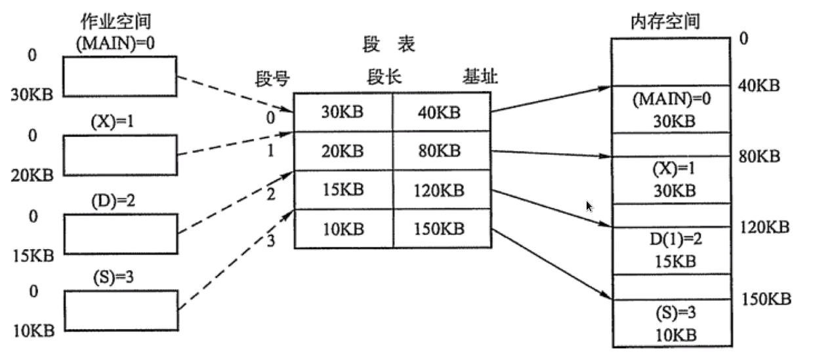

分页机制(逻辑地址和物理地址分离的内存分配管理方案)
* 程序的逻辑地址划分为固定大小的页(Page)
* 物理地址划分为同样大小的帧(Frame)
* 通过页表对应逻辑地址和物理地址
* 

分段机制(为了满足代码的一些逻辑需求)
* 数据共享, 数据保护, 动态链接等
* 通过段实现逻辑地址和物理地址的映射关系
* 每个段内部是连续内存分配, 段和段之间是离散分配
* 

分页 vs 分段
* 页是处于内存利用率的角度提出的离散分配机制
* 段是处于用户角度, 用于数据保护, 数据隔离等用途的管理机制
* 页的大小是固定的, 操作系统决定; 段大小不确定, 用户程序决定

虚拟内存
* 局部性原理, 程序运行时候只有部分必要的信息装入内存
* 内存中暂时不需要的内容放到硬盘上
* 系统似乎提供了比实际内存大得多的容量, 称之为虚拟内存

内存抖动(颠簸, 本质是频繁的页调度行为)
* 频繁的页调度, 进程不断产生缺页中断
* 置换一个页, 又不断再次需要这个页
* 运行程序太多, 页面替换策略不好; 终止进程或者增加物理内存

进程和线程对比
* 进程是对运行时程序的封装, 是系统资源调度和分配的基本单位
* 线程是进程的子任务, cpu 调度和分配的基本单位, 实现进程内并发
* 一个进程可以包含多个进程, 线程依赖进程存在, 并共享进程
